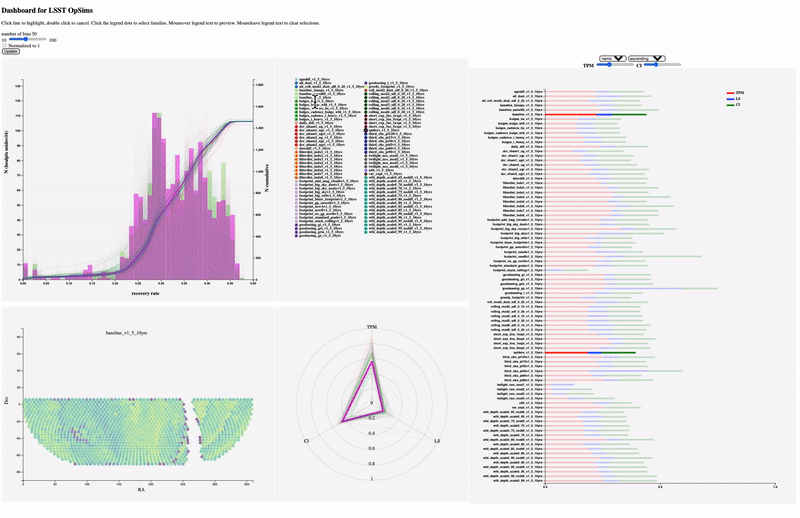

# OpSim_Dashboard

A tool for visualizing the performance of LSST operations simulations (OpSim). The dashboard is built using ds.js, the most popular javascript library for creating interactive data visualizations. The dashboard contains the following visualizations:

- Skymap
- Histogram
- Bar Plot 
- Radar Plot

All visualizations are linked together to provide a comprehensive understanding of simulated operations. 

## Using the Dashboard

The dashboard allows you to visualize the performance of LSST operations simulations in several ways. The Skymap shows the distribution of any values on the celestial sphere, the Histogram shows the distribution of observations over sky positions, the Ranking Bar Plot shows the ranking of simulated operation based on a chosen parameter, and the Radar Plot shows the distribution of observations in multiple dimensions.

Visit [https://xiaolng.github.io/OpSimDashboard](https://xiaolng.github.io/OpSimDashboard) for a demonstration 

To make your dashboard, simply replace the data file. The data used in the dashboard is available in a CSV format and can be found in the **data** folder. It's important to note that the dashboard expects the data to have the following columns:

- name of the OpSim
- metric names
- metric values across sky 

## Citation

